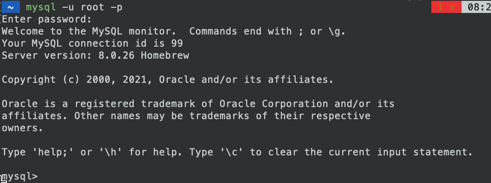

## SQL 基础知识

### MySQL 介绍


**MySQL**是最流行的关系型数据库管理系统，在WEB应用方面MySQL是最好的RDBMS(Relational Database Management System：关系数据库管理系统)应用软件之一。

### MySQL 优点

MySQL是一个关系型数据库管理系统，由瑞典MySQL AB公司开发，目前属于Oracle公司。MySQL是一种关联数据库管理系统，关联数据库将数据保存在不同的表中，而不是将所有数据放在一个大仓库内，这样就增加了速度并提高了灵活性。

- MySQL是开源的，所以你不需要支付额外的费用。
- MySQL支持大型的数据库。可以处理拥有上千万条记录的大型数据库。
- MySQL使用标准的SQL数据语言形式。
- MySQL可以允许于多个系统上，并且支持多种语言。这些编程语言包括C、C++、Python、Java、Perl、PHP、Eiffel、Ruby和Tcl等。
- MySQL对PHP有很好的支持，PHP是目前最流行的Web开发语言。
- MySQL支持大型数据库，支持5000万条记录的数据仓库，32位系统表文件最大可支持4GB，64位系统支持最大的表文件为8TB。
- MySQL是可以定制的，采用了GPL协议，你可以修改源码来开发自己的MySQL系统。

### 什么是数据库？

数据库（Database）是按照数据结构来组织、存储和管理数据的仓库，每个数据库都有一个或多个不同的API用于创建，访问，管理，搜索和复制所保存的数据。实现数据共享、减少冗余、数据独立性强、统一的控制模式。

我们也可以将数据存储在文件中，但是在文件中读写数据速度相对较慢。

数据库四个阶段：

1. 人工管理
2. 文件系统
3. 数据库系统
4. 高级数据库

三个种类：

1. 层次级数据库
2. 网络式数据库
3. 关系式数据库

所以，现在我们使用关系型数据库管理系统（RDBMS）来存储和管理的大数据量。所谓的关系型数据库，是建立在关系模型基础上的数据库，借助于集合代数等数学概念和方法来处理数据库中的数据。

RDBMS即关系数据库管理系统(Relational Database Management System)的特点：

- 1.数据以表格的形式出现
- 2.每行为各种记录名称
- 3.每列为记录名称所对应的数据域
- 4.许多的行和列组成一张表单
- 5.若干的表单组成database

### RDBMS 术语

在我们开始学习MySQL 数据库前，让我们先了解下RDBMS的一些术语：

- **数据库:** 数据库是一些关联表的集合。.
- **数据表:** 表是数据的矩阵。在一个数据库中的表看起来像一个简单的电子表格。
- **列:** 一列(数据元素) 包含了相同的数据, 例如邮政编码的数据。
- **行：**一行（=元组，或记录）是一组相关的数据，例如一条用户订阅的数据。
- **冗余**：存储两倍数据，冗余可以使系统速度更快。
- **主键**：主键是唯一的。一个数据表中只能包含一个主键。你可以使用主键来查询数据。
- **外键：**外键用于关联两个表。
- **复合键**：复合键（组合键）将多个列作为一个索引键，一般用于复合索引。
- **索引：**使用索引可快速访问数据库表中的特定信息。索引是对数据库表中一列或多列的值进行排序的一种结构。类似于书籍的目录。
- **参照完整性:** 参照的完整性要求关系中不允许引用不存在的实体。与实体完整性是关系模型必须满足的完整性约束条件，目的是保证数据的一致性。

## MySQL 安装

所有平台的 MySQL 下载地址为： [MySQL 下载](https://www.mysql.com/cn/downloads/). 挑选你需要的 MySQL Community Server 版本及对应的平台。

注意：安装过程我们需要通过开启管理员权限来安装，否则会由于权限不足导致无法安装。

Linux / UNIX 上安装 MySQL
Linux 平台上推荐使用 RPM 包来安装 MySQL ，MySQL AB 提供了以下 RPM 包的下载地址：

- MySQL - MySQL 服务器。如果不是只想连接运行在另一台机器上的 MySQL 服务器，请你选择该选项。
- MySQL-client - MySQL 客户端程序，用于连接并操作 Mysql 服务器。
- MySQL-devel - 库和包含文件，如果你想要编译其它如 Perl 模块等 MySQL 客户端，则需要安装该 RPM 包。
- MySQL-shared - 该软件包包含某些语言和应用程序需要动态装载的共享库(libmysqlclient.so*)，使用 MySQL。
- MySQL-bench - MySQL 数据库服务器的基准和性能测试工具。

### 在windows 安装MySQL

在MySQL官网下载安装包安装后自动打开，可在任务管理器看到MySQL服务进程`mysqld.exe`。

#### 启动服务

- `services.msc`可看到MySQL的服务项，随开机启动；
- 也可通过cmd命令`net start MySQL`启动；停止使用`net stop MySQL`。

#### 登陆命令

```shell
mysql -h hostname -u root -p
```

成功后即可执行SQL语句。

### 在Ubantu安装MySQL

```shell
sudo apt-get install mysql-server
# 在成功安装mysql后，可以直接使用root账户登录，注意这个账户是默认没有密码的。因此为了数据库的安全，需要第一时间给root用户设置密码。
GRANT ALL PRIVILEGES ON *.* TO root@localhost IDENTIFIED BY "<password>";
# 将以上命令中的<password>替换为你要设定的密码即可。设置密码后，如果再以root用户登录就需要输入密码了
```


### 在Mac上安装MySQL

```shell
# 使用brew安装
brew install mysql
# 验证是否安装完成
mysqladmin --version
# 启动mysql服务
mysql.server start
# 检查是否启动mysql
ps -ef | grep mysqld

# 关闭运行中的数据库
mysqladmin -u root -p shutdown

# 更换密码
mysqladmin -u root password "new_password";
# or mysql_secure_installation 
# 使用root账户登陆mysql
mysql -u root -p
```
当输出 `mysql>` 提示符，这说明你已经成功连接到 MySQL 服务器上
如此图：

### Linux系统启动时启动 MySQL

如果你需要在Linux系统启动时启动 MySQL 服务器，你需要在 /etc/rc.local 文件中添加以下命令：

```shell
/etc/init.d/mysqld start
```

同样，你需要将 mysqld 二进制文件添加到 /etc/init.d/ 目录中。

## MySQL 管理

### 创建新用户

```sql
# 列出 MySQL 的数据库列表
SHOW DATABASES

# 设置活动databeses
use mysql;

# 向mysql.user中添加内容
# 创建新用户
INSERT INTO user 
          (host, user, password, 
           select_priv, insert_priv, update_priv) 
           VALUES ('localhost', 'guest', 
           PASSWORD('guest123'), 'Y', 'Y', 'Y');
# 在添加用户时，请注意使用MySQL提供的 PASSWORD() 函数来对密码进行加密。

# 刷新授权表
FLUSH PRIVILEGES;

# 另一种创建用户的方法：使用GRANT命令
GRANT SELECT,INSERT,UPDATE,DELETE,CREATE,DROP
ON TUTORIALS.*
TO 'zara'@'localhost'
IDENTIFIED BY 'zara123';

# 分配数据库给用户
create database db_web_monitor
# 然后将这个数据库授予一个叫xavier的用户使用
mysql> GRANT ALL PRIVILEGES ON db_web_monitor.* TO xavier@localhost IDENTIFIED BY "xavier";
# 这样就可以使用xavier用户，密码为xavier在本机登录MySQL操作db_web_monitor数据库了。

# 授予远程使用权限
mysql>GRANT ALL PRIVILEGES ON db_web_monitor.* TO xavier@"%" IDENTIFIED BY "xavier";
```

### 命令

```sql
# 显示指定数据库的所有表
SHOW TABLES
# 显示数据表的属性，属性类型，主键信息
SHOW COLUMNS FROM 数据表
# 显示数据表的详细索引信息
SHOW INDEX FROM 数据表
# 该命令将输出MySQL数据库管理系统的性能及统计信息。
SHOW TABLE STATUS from DB

```

### 数据库操作
```shell
# 删除数据库
mysqladmin -u root -p drop test
# 创建新数据库
mysqladmin -u root -p create test 

```

## 数据类型

### 数值类型

| **类型**     | **大小**                                 | **范围（有符号）**                                           | **范围（无符号）**                                           | **用途**        |
| :----------- | :--------------------------------------- | :----------------------------------------------------------- | :----------------------------------------------------------- | :-------------- |
| TINYINT      | 1 字节                                   | (-128，127)                                                  | (0，255)                                                     | 小整数值        |
| SMALLINT     | 2 字节                                   | (-32 768，32 767)                                            | (0，65 535)                                                  | 大整数值        |
| MEDIUMINT    | 3 字节                                   | (-8 388 608，8 388 607)                                      | (0，16 777 215)                                              | 大整数值        |
| INT或INTEGER | 4 字节                                   | (-2 147 483 648，2 147 483 647)                              | (0，4 294 967 295)                                           | 大整数值        |
| BIGINT       | 8 字节                                   | (-9 233 372 036 854 775 808，9 223 372 036 854 775 807)      | (0，18 446 744 073 709 551 615)                              | 极大整数值      |
| FLOAT        | 4 字节                                   | (-3.402 823 466 E+38，-1.175 494 351 E-38)，0，(1.175 494 351 E-38，3.402 823 466 351 E+38) | 0，(1.175 494 351 E-38，3.402 823 466 E+38)                  | 单精度 浮点数值 |
| DOUBLE       | 8 字节                                   | (-1.797 693 134 862 315 7 E+308，-2.225 073 858 507 201 4 E-308)，0，(2.225 073 858 507 201 4 E-308，1.797 693 134 862 315 7 E+308) | 0，(2.225 073 858 507 201 4 E-308，1.797 693 134 862 315 7 E+308) | 双精度 浮点数值 |
| DECIMAL      | 对DECIMAL(M,D) ，如果M>D，为M+2否则为D+2 | 依赖于M和D的值                                               | 依赖于M和D的值                                               | 小数值          |

### 日期和时间类型

| 类型      | 大小 (字节) | 范围                                                         | 格式                | 用途                     |
| :-------- | :---------- | :----------------------------------------------------------- | :------------------ | :----------------------- |
| DATE      | 3           | 1000-01-01/9999-12-31                                        | YYYY-MM-DD          | 日期值                   |
| TIME      | 3           | '-838:59:59'/'838:59:59'                                     | HH:MM:SS            | 时间值或持续时间         |
| YEAR      | 1           | 1901/2155                                                    | YYYY                | 年份值                   |
| DATETIME  | 8           | 1000-01-01 00:00:00/9999-12-31 23:59:59                      | YYYY-MM-DD HH:MM:SS | 混合日期和时间值         |
| TIMESTAMP | 4           | 1970-01-01 00:00:00/2038 结束时间是第 2147483647 秒，北京时间 2038-1-19 11:14:07，格林尼治时间 2038-1-19 03:14:07 | YYYYMMDD HHMMSS     | 混合日期和时间值，时间戳 |

### 字符串类型

| 类型       | 大小                | 用途                            |
| :--------- | :------------------ | :------------------------------ |
| CHAR       | 0-255字节           | 定长字符串                      |
| VARCHAR    | 0-65535 字节        | 变长字符串                      |
| TINYBLOB   | 0-255字节           | 不超过 255 个字符的二进制字符串 |
| TINYTEXT   | 0-255字节           | 短文本字符串                    |
| BLOB       | 0-65 535字节        | 二进制形式的长文本数据          |
| TEXT       | 0-65 535字节        | 长文本数据                      |
| MEDIUMBLOB | 0-16 777 215字节    | 二进制形式的中等长度文本数据    |
| MEDIUMTEXT | 0-16 777 215字节    | 中等长度文本数据                |
| LONGBLOB   | 0-4 294 967 295字节 | 二进制形式的极大文本数据        |
| LONGTEXT   | 0-4 294 967 295字节 | 极大文本数据                    |


## 创建数据表

语法：

- 表名
- 表字段名
- 定义每个表字段

`CREATE TABLE table_name (column_name column_type);`

## 删除数据表

`DROP TABLE table_name ;`

## 修改数据

### insert数据

```sql
INSERT INTO table_name ( field1, field2,...fieldN)
VALUES ( value1, value2,...valueN);
```

### update数据

```sql
UPDATE table_name SET field1=new-value1, field2=new-value2
[WHERE Clause]
```

- 你可以同时更新一个或多个字段。
- 你可以在 WHERE 子句中指定任何条件。
- 你可以在一个单独表中同时更新数据。

### delete数据

```sql
DELETE FROM table_name [WHERE Clause]
```

- 如果没有指定 WHERE 子句，MySQL表中的所有记录将被删除。
- 你可以在 WHERE 子句中指定任何条件
- 您可以在单个表中一次性删除记录。

### alter命令

#### 删除，添加或修改表字段

如下命令使用了 ALTER 命令及 DROP 子句来删除以上创建表的 i 字段：

```sql
mysql> ALTER TABLE testalter_tbl  DROP i; 
```
如果数据表中只剩余一个字段则无法使用DROP来删除字段。MySQL 中使用 ADD 子句来想数据表中添加列，如下实例在表 testalter_tbl 中添加 i 字段，并定义数据类型:
```sql
mysql> ALTER TABLE testalter_tbl ADD i INT; 
```
执行以上命令后，i 字段会自动添加到数据表字段的末尾。

如果需要指定新增字段的位置，可以使用MySQL提供的关键字 FIRST (设定位第一列)， AFTER 字段名（设定位于某个字段之后）。尝试以下 ALTER TABLE 语句, 在执行成功后，使用 SHOW COLUMNS 查看表结构的变化

```sql
ALTER TABLE testalter_tbl DROP i;
ALTER TABLE testalter_tbl ADD i INT FIRST;
ALTER TABLE testalter_tbl DROP i;
ALTER TABLE testalter_tbl ADD i INT AFTER c;
```

FIRST 和 AFTER 关键字只占用于 ADD 子句，所以如果你想重置数据表字段的位置就需要先使用 DROP 删除字段然后使用 ADD 来添加字段并设置位置。

#### 修改字段类型及名称
如果需要修改字段类型及名称, 你可以在ALTER命令中使用 MODIFY 或 CHANGE 子句 。
例如，把字段 c 的类型从 CHAR(1) 改为 CHAR(10)，可以执行以下命令:
```sql
ALTER TABLE testalter_tbl MODIFY c CHAR(10);
```

使用 CHANGE 子句, 语法有很大的不同。 在 CHANGE 关键字之后，紧跟着的是你要修改的字段名，然后指定新字段的类型及名称。尝试如下实例：
```sql
ALTER TABLE testalter_tbl CHANGE i j BIGINT;
```
如果你现在想把字段 j 从 BIGINT 修改为 INT，SQL语句如下：
```sql
ALTER TABLE testalter_tbl CHANGE j j INT;
```


##### ALTER TABLE 对 Null 值和默认值的影响
当你修改字段时，你可以指定是否包含只或者是否设置默认值。
以下实例，指定字段 j 为 NOT NULL 且默认值为100 。
```sql
ALTER TABLE testalter_tbl 
MODIFY j BIGINT NOT NULL DEFAULT 100;
```
如果你不设置默认值，MySQL会自动设置该字段默认为 NULL。

#### 修改字段默认值

```sql
# 可以使用 ALTER 来修改字段的默认值
ALTER TABLE testalter_tbl ALTER i SET DEFAULT 1000;
# 你也可以使用 ALTER 命令及 DROP子句来删除字段的默认值
ALTER TABLE testalter_tbl ALTER i DROP DEFAULT;
# 修改数据表类型，可以使用 ALTER 命令及 TYPE 子句来完成
ALTER TABLE testalter_tbl TYPE = MYISAM;
# 注意：查看数据表类型可以使用 SHOW TABLE STATUS 语句。
```


#### 修改表名
如果需要修改数据表的名称，可以在 ALTER TABLE 语句中使用 RENAME 子句来实现。

尝试以下实例将数据表 testalter_tbl 重命名为 alter_tbl：
```sql
mysql> ALTER TABLE testalter_tbl RENAME TO alter_tbl;
```
ALTER 命令还可以用来创建及删除MySQL数据表的索引


## 查询数据表

### 操作符

| 操作符   | 描述                                                         | 实例                 |
| :------- | :----------------------------------------------------------- | :------------------- |
| =        | 等号，检测两个值是否相等，如果相等返回true                   | (A = B) 返回false。  |
| <> 或 != | 不等于，检测两个值是否相等，如果不相等返回true               | (A != B) 返回 true。 |
| >        | 大于号，检测左边的值是否大于右边的值, 如果左边的值大于右边的值返回true | (A > B) 返回false。  |
| <        | 小于号，检测左边的值是否小于右边的值, 如果左边的值小于右边的值返回true | (A < B) 返回 true。  |
| >=       | 大于等于号，检测左边的值是否大于或等于右边的值, 如果左边的值大于或等于右边的值返回true | (A >= B) 返回false。 |
| <=       | 小于等于号，检测左边的值是否小于于或等于右边的值, 如果左边的值小于或等于右边的值返回true | (A <= B) 返回 true。 |

### where子句

MySQL的WHERE子句的字符串比较是不区分大小写的。 你可以使用 BINARY 关键字来设定WHERE子句的字符串比较是区分大小写的。

```sql
SELECT  from test \
          WHERE BINARY w3cschool_author='jesse';
```

### Like子句

SQL LIKE 子句中使用百分号(%)字符来表示任意字符，类似于UNIX或正则表达式中的星号 (*)。

如果没有使用百分号(%), LIKE 子句与等号（=）的效果是一样的。

#### SQL模式匹配

```sql
“_” 匹配单个字符,”\_” 匹配”_”

“%” 匹配任意个字符,包括零个字符

sql模式下的匹配，缺省是对于字母的大小写没有要求，并且sql模式下，“=”或”!=”是不能在模糊匹配中使用的，而是使用 like 或 not like.
```

语法：

```sql
SELECT field1, field2,...fieldN 
FROM table_name1, table_name2...
WHERE field1 LIKE "%test" [AND [OR]] filed2 = 'somevalue'
```

### GROUP BY子句

GROUP BY 语句根据一个或多个列对结果集进行分组。

在分组的列上我们可以使用 COUNT, SUM, AVG,等函数。

> 分组后的数据丧失组内特异性

### ORDER BY子句

- 你可以使用任何字段来作为排序的条件，从而返回排序后的查询结果。
- 你可以设定多个字段来排序。
- 你可以使用 ASC 或 DESC 关键字来设置查询结果是按升序或降序排列。 默认情况下，它是按升排列。
- 你可以添加 WHERE...LIKE 子句来设置条件。

### Join 语句


## MySQL数据处理

### NULL值处理

关于null值的处理，MySQL提供了三大运算符:

- **IS NULL:** 当列的值是NULL,此运算符返回true。
- **IS NOT NULL:** 当列的值不为NULL, 运算符返回true。
- **<=>:** 比较操作符（不同于=运算符），当比较的的两个值为NULL时返回true。

关于 NULL 的条件比较运算是比较特殊的。你不能使用 = NULL 或 != NULL 在列中查找 NULL 值 。

在MySQL中，NULL值与任何其它值的比较（即使是NULL）永远返回false，即 NULL = NULL 返回false 。

MySQL中处理NULL使用IS NULL和IS NOT NULL运算符。

### 正则表达式

我们已经了解到MySQL可以通过 **LIKE ...%** 来进行模糊匹配。

MySQL 同样也支持其他正则表达式的匹配， MySQL中使用 REGEXP 操作符来进行正则表达式匹配。

如果您了解PHP或Perl，那么操作起来就非常简单，因为MySQL的正则表达式匹配与这些脚本的类似。

下表中的正则模式可应用于 REGEXP 操作符中。

| 模式       | 描述                                                         |
| :--------- | :----------------------------------------------------------- |
| ^          | 匹配输入字符串的开始位置。如果设置了 RegExp 对象的 Multiline 属性，^ 也匹配 '\n' 或 '\r' 之后的位置。 |
| $          | 匹配输入字符串的结束位置。如果设置了RegExp 对象的 Multiline 属性，$ 也匹配 '\n' 或 '\r' 之前的位置。 |
| .          | 匹配除 "\n" 之外的任何单个字符。要匹配包括 '\n' 在内的任何字符，请使用象 '[.\n]' 的模式。 |
| [...]      | 字符集合。匹配所包含的任意一个字符。例如， '[abc]' 可以匹配 "plain" 中的 'a'。 |
| [^...]     | 负值字符集合。匹配未包含的任意字符。例如， '[^abc]' 可以匹配 "plain" 中的'p'。 |
| p1\|p2\|p3 | 匹配 p1 或 p2 或 p3。例如，'z\|food' 能匹配 "z" 或 "food"。'(z\|f)ood' 则匹配 "zood" 或 "food"。 |
|            | 匹配前面的子表达式零次或多次。例如，zo 能匹配 "z" 以及 "zoo"。* 等价于{0,}。 |
| +          | 匹配前面的子表达式一次或多次。例如，'zo+' 能匹配 "zo" 以及 "zoo"，但不能匹配 "z"。+ 等价于 {1,}。 |
| {n}        | n 是一个非负整数。匹配确定的 n 次。例如，'o{2}' 不能匹配 "Bob" 中的 'o'，但是能匹配 "food" 中的两个 o。 |
| {n,m}      | m 和 n 均为非负整数，其中n <= m。最少匹配 n 次且最多匹配 m 次。 |


**示例**

查找name字段中以'st'为开头的所有数据：

```
mysql> SELECT name FROM person_tbl WHERE name REGEXP '^st';
```

查找name字段中以'ok'为结尾的所有数据：

```
mysql> SELECT name FROM person_tbl WHERE name REGEXP 'ok$';
```

查找name字段中包含'mar'字符串的所有数据：

```
mysql> SELECT name FROM person_tbl WHERE name REGEXP 'mar';
```

查找name字段中以元音字符开头或以'ok'字符串结尾的所有数据：

```
mysql> SELECT name FROM person_tbl WHERE name REGEXP '^[aeiou]|ok$';
```


## MySQL 事务

MySQL 事务主要用于处理操作量大，复杂度高的数据。比如说，在人员管理系统中，你删除一个人员，你即需要删除人员的基本资料，也要删除和该人员相关的信息，如信箱，文章等等，这样，这些数据库操作语句就构成一个事务！

- 在 MySQL 中只有使用了 Innodb 数据库引擎的数据库或表才支持事务。
- 事务处理可以用来维护数据库的完整性，保证成批的SQL语句要么全部执行，要么全部不执行。
- 事务用来管理 insert , update , delete 语句。

一般来说，事务是必须满足4个条件（ACID）： Atomicity（原子性或不可分割性）、Consistency（一致性）、Isolation（隔离性或独立性）、Durability（持久性）

- 1、**原子性：**一组事务，要么成功；要么撤回，即事务在执行过程中出错会回滚到事务开始前的状态。
- 2、**一致性** ： 一个事务不论是开始前还是结束后，数据库的完整性都没有被破坏。因此写入的数据必须完全符合所有预设规则（资料精确度、串联性以及后续数据库能够自发完成预定工作）。
- 3、**隔离性：**数据库允许多个事务并发的同时对其数据进行读写修改等操作，隔离性可以防止多个事务并发执行时由于交叉执行而导致数据的不一致。事务隔离可分为：Read uncommitted（读未提交）、Read committed（读提交）、Repeatable read（可重复读）、Serializable（串行化）。
- 4、持久**性：**事务在处理结束后对数据做出的修改是永久的，无法丢失。

### 事务控制语句

1，显式的开始一个事务：

```sql
start transaction
```

或

```sql
begin
```

2, 做保存点，一个事务中可以有多个保存点：

```sql
savepoint 保存点名称
```

3, 提交事务，并使数据库中进行的所有修改成为永久性的：

```sql
commit
```

或

```sql
commit work
```

4，回滚结束用户的事务，并撤销正在进行的所有未提交的修改：

```sql
rollback
```

或

```sql
rollback work
```

5.删除一个事务的保存点，若没有指定保存点，执行该语句操作会抛错。

```sql
release savepoint 保存点名称
```

6.将事务滚回标记点：

```sql
rollback to 标记点
```

7.设置事务的隔离级别。InnoDB 存储引擎提供事务的隔离级别有READ UNCOMMITTED、READ COMMITTED、REPEATABLE READ 和 SERIALIZABLE。

```sql
set transaction
```

### 事务处理方法

1.用 begin ， rollback ， commit 来实现事务处理。

2.用 set 来改变 MySQL 的自动提交模式。

- set autocommit = 0 （禁止自动提交）。
- set autocommit = 1 （开启自动提交）。


## 建立索引

索引时，你需要确保该索引是应用在 SQL 查询语句的条件(一般作为 WHERE 子句的条件)。

### 普通索引

#### 创建索引

这是最基本的索引，它没有任何限制。它有以下几种创建方式：

```sql
CREATE INDEX indexName ON mytable(username(length)); 
```

如果是CHAR，VARCHAR类型，length可以小于字段实际长度；如果是BLOB和TEXT类型，必须指定 length。

#### 修改表结构(添加索引)

```sql
ALTER table tableName ADD INDEX indexName(columnName)
```

#### 删除索引的语法

```sql
DROP INDEX [indexName] ON mytable; 
```

### 唯一索引

它与前面的普通索引类似，不同的就是：索引列的值必须唯一，但允许有空值。如果是组合索引，则列值的组合必须唯一。它有以下几种创建方式：

#### 创建索引

```sql
CREATE UNIQUE INDEX indexName ON mytable(username(length)) 
```

#### 修改表结构

```sql
ALTER table mytable ADD UNIQUE [indexName] (username(length))
```

### 使用ALTER 命令添加和删除索引

```sql
mysql> ALTER TABLE testalter_tbl ADD INDEX (c);
```

你还可以在 ALTER 命令中使用 DROP 子句来删除索引。尝试以下实例删除索引:

```sql
mysql> ALTER TABLE testalter_tbl DROP INDEX c;
```

### 使用 ALTER 命令添加和删除主键

主键只能作用于一个列上，添加主键索引时，你需要确保该主键默认不为空（NOT NULL）。实例如下：

```sql
mysql> ALTER TABLE testalter_tbl MODIFY i INT NOT NULL;
mysql> ALTER TABLE testalter_tbl ADD PRIMARY KEY (i);
```

你也可以使用 ALTER 命令删除主键：

```sql
mysql> ALTER TABLE testalter_tbl DROP PRIMARY KEY;
```

删除主键时只需指定PRIMARY KEY，但在删除索引时，你必须知道索引名。


## 临时表

MySQL 临时表在我们需要保存一些临时数据时是非常有用的。临时表只在当前连接可见，当关闭连接时，MySQL会自动删除表并释放所有空间。 MySQL临时表只在当前连接可见，如果你使用PHP脚本来创建MySQL临时表，那每当PHP脚本执行完成后，该临时表也会自动销毁。

如果你使用了其他MySQL客户端程序连接MySQL数据库服务器来创建临时表，那么只有在关闭客户端程序时才会销毁临时表，当然你也可以手动销毁。

### 创建临时表

```sql
REATE TEMPORARY TABLE SalesSummary (
product_name VARCHAR(50) NOT NULL
, total_sales DECIMAL(12,2) NOT NULL DEFAULT 0.00
, avg_unit_price DECIMAL(7,2) NOT NULL DEFAULT 0.00
, total_units_sold INT UNSIGNED NOT NULL DEFAULT 0
);
```

## 自增序列

MySQL序列是一组整数：1, 2, 3, ...，由于一张数据表只能有一个字段自增主键， 如果你想实现其他字段也实现自动增加，就可以使用MySQL序列来实现。

### 使用自增序列
```sql
# 使用 MySQL AUTO_INCREMENT 来定义列。
CREATE TABLE insect
(
id INT UNSIGNED NOT NULL AUTO_INCREMENT = 100,
PRIMARY KEY (id),
name VARCHAR(30) NOT NULL, # type of insect
date DATE NOT NULL, # date collected
origin VARCHAR(30) NOT NULL # where collected
);


```

### 获取AUTO_INCREMENT值
在MySQL的客户端中你可以使用 SQL中的LAST_INSERT_ID( ) 函数来获取最后的插入表中的自增列的值。


## 重复数据
有些 MySQL 数据表中可能存在重复的记录，有些情况我们允许重复数据的存在，但有时候我们也需要删除这些重复的数据。

设置 primary key 为数据唯一
```sql
CREATE TABLE person_tbl
(
   first_name CHAR(20) NOT NULL,
   last_name CHAR(20) NOT NULL,
   sex CHAR(10),
   PRIMARY KEY (last_name, first_name)
);
```

另一种方法是设置UNIQUE索引
```sql
CREATE TABLE person_tbl
(
   first_name CHAR(20) NOT NULL,
   last_name CHAR(20) NOT NULL,
   sex CHAR(10),
   UNIQUE (last_name, first_name)
);
```
### 统计重复数据

以下我们将统计表中 first_name 和 last_name的重复记录数：

```sql
mysql> SELECT COUNT(*) as repetitions, last_name, first_name
    -> FROM person_tbl
    -> GROUP BY last_name, first_name
    -> HAVING repetitions > 1;
```
以上查询语句将返回 person_tbl 表中重复的记录数。 一般情况下，查询重复的值，请执行以下操作：
- 确定哪一列包含的值可能会重复。
- 在列选择列表使用COUNT(*)列出的那些列。
- 在GROUP BY子句中列出的列。
- HAVING子句设置重复数大于1。

### 过滤重复数据

如果你需要读取不重复的数据可以在 SELECT 语句中使用 DISTINCT 关键字来过滤重复数据。

```sql
mysql> SELECT DISTINCT last_name, first_name
    -> FROM person_tbl
    -> ORDER BY last_name;
```

你也可以使用 GROUP BY 来读取数据表中不重复的数据：

```sql
mysql> SELECT last_name, first_name
    -> FROM person_tbl
    -> GROUP BY (last_name, first_name);
```

### 删除重复数据

如果你想删除数据表中的重复数据，你可以使用以下的SQL语句：

```sql
mysql> CREATE TABLE tmp SELECT last_name, first_name, sex
    ->                  FROM person_tbl;
    ->                  GROUP BY (last_name, first_name);
mysql> DROP TABLE person_tbl;
mysql> ALTER TABLE tmp RENAME TO person_tbl;
```

当然你也可以在数据表中添加 INDEX（索引） 和 PRIMAY KEY（主键）这种简单的方法来删除表中的重复记录。方法如下：

```sql
mysql> ALTER IGNORE TABLE person_tbl
ADD PRIMARY KEY (last_name, first_name);
```

## MySQL 常用函数

### 时间函数

#### `date_add()、date_sub()`

增加/减少一天

```sql
 DATE_ADD(date,INTERVAL expr type)
```

| Type 值            |
| :----------------- |
| MICROSECOND        |
| SECOND             |
| MINUTE             |
| HOUR               |
| DAY                |
| WEEK               |
| MONTH              |
| QUARTER            |
| YEAR               |
| SECOND_MICROSECOND |
| MINUTE_MICROSECOND |
| MINUTE_SECOND      |
| HOUR_MICROSECOND   |
| HOUR_SECOND        |
| HOUR_MINUTE        |
| DAY_MICROSECOND    |
| DAY_SECOND         |
| DAY_MINUTE         |
| DAY_HOUR           |
| YEAR_MONTH         |

#### `datediff()`

DATEDIFF() 函数返回两个日期之间的天数。

```sql
DATEDIFF(date1,date2)
```

#### `date_format()`

DATE_FORMAT() 函数用于以不同的格式显示日期/时间数据。

 ```sql
 DATE_FORMAT(date,format)
 ```

| 格式 | 描述                                           |
| :--- | :--------------------------------------------- |
| %a   | 缩写星期名                                     |
| %b   | 缩写月名                                       |
| %c   | 月，数值                                       |
| %D   | 带有英文前缀的月中的天                         |
| %d   | 月的天，数值（00-31）                          |
| %e   | 月的天，数值（0-31）                           |
| %f   | 微秒                                           |
| %H   | 小时（00-23）                                  |
| %h   | 小时（01-12）                                  |
| %I   | 小时（01-12）                                  |
| %i   | 分钟，数值（00-59）                            |
| %j   | 年的天（001-366）                              |
| %k   | 小时（0-23）                                   |
| %l   | 小时（1-12）                                   |
| %M   | 月名                                           |
| %m   | 月，数值（00-12）                              |
| %p   | AM 或 PM                                       |
| %r   | 时间，12-小时（hh:mm:ss AM 或 PM）             |
| %S   | 秒（00-59）                                    |
| %s   | 秒（00-59）                                    |
| %T   | 时间, 24-小时（hh:mm:ss）                      |
| %U   | 周（00-53）星期日是一周的第一天                |
| %u   | 周（00-53）星期一是一周的第一天                |
| %V   | 周（01-53）星期日是一周的第一天，与 %X 使用    |
| %v   | 周（01-53）星期一是一周的第一天，与 %x 使用    |
| %W   | 星期名                                         |
| %w   | 周的天（0=星期日, 6=星期六）                   |
| %X   | 年，其中的星期日是周的第一天，4 位，与 %V 使用 |
| %x   | 年，其中的星期一是周的第一天，4 位，与 %v 使用 |
| %Y   | 年，4 位                                       |
| %y   | 年，2 位                                       |

**示例**

```sql
select  
DATE_FORMAT(NOW(),'%b %d %Y %h:%i %p'),
DATE_FORMAT(NOW(),'%m-%d-%Y'),
DATE_FORMAT(NOW(),'%d %b %y'),
DATE_FORMAT(NOW(),'%d %b %Y %T:%f')
```

结果如下所示：

```sql
 Nov 04 2008 11:45 PM
 11-04-2008
 04 Nov 08
 04 Nov 2008 11:45:34:243 
```

#### `now()、curdate()、curtime()`

NOW() 返回当前的日期和时间。

| NOW()               | CURDATE()  | CURTIME() |
| :------------------ | :--------- | :-------- |
| 2008-11-11 12:45:34 | 2008-11-11 | 12:45:34  |

#### `Date()`

DATE() 函数提取日期或日期/时间表达式的日期部分。

`2008-11-11 13:23:44.657` → `2008-11-11`

#### `extract()`

EXTRACT() 函数用于返回日期/时间的单独部分，比如年、月、日、小时、分钟等等。

```sql
 EXTRACT(unit FROM date)
```

date 参数是合法的日期表达式。unit 参数可以是下列的值：

| Unit 值            |
| :----------------- |
| MICROSECOND        |
| SECOND             |
| MINUTE             |
| HOUR               |
| DAY                |
| WEEK               |
| MONTH              |
| QUARTER            |
| YEAR               |
| SECOND_MICROSECOND |
| MINUTE_MICROSECOND |
| MINUTE_SECOND      |
| HOUR_MICROSECOND   |
| HOUR_SECOND        |
| HOUR_MINUTE        |
| DAY_MICROSECOND    |
| DAY_SECOND         |
| DAY_MINUTE         |
| DAY_HOUR           |
| YEAR_MONTH         |

### 字符串连接函数

#### `Concat()、concat_ws()、group_concat()`

字符串连接函数 

使用方法：
CONCAT(str1,str2,…) 

CONCAT_WS(separator,str1,str2,...)

group_concat([DISTINCT] 要连接的字段 [Order BY ASC/DESC 排序字段] [Separator '分隔符'])

**CONCAT()**返回结果为连接参数产生的字符串。如有任何一个参数为NULL ，则返回值为 NULL。

> 注意：
> 如果所有参数均为非二进制字符串，则结果为非二进制字符串。 
> 如果自变量中含有任一二进制字符串，则结果为一个二进制字符串。
> 一个数字参数被转化为与之相等的二进制字符串格式；若要避免这种情况，可使用显式类型 cast

**CONCAT_WS()** 代表 CONCAT With Separator ，是CONCAT()的特殊形式。第一个参数是其它参数的分隔符。分隔符的位置放在要连接的两个字符串之间。分隔符可以是一个字符串，也可以是其它参数。

> 和MySQL中concat函数不同的是, concat_ws函数在执行的时候,不会因为NULL值而返回NULL 。
>
> 如果分隔符为 NULL，则结果为 NULL。函数会忽略任何分隔符参数后的 NULL 值。


**Group_concat()：**

```sql
# 以id分组，把name字段的值打印在一行，逗号分隔(默认)
select id,group_concat(name) from aa group by id;

# 以id分组，把name字段的值打印在一行，分号分隔
select id,group_concat(name separator ';') from aa group by id;

# 以id分组，把去冗余的name字段的值打印在一行
select id,group_concat(distinct name) from aa group by id;

# 以id分组，把name字段的值打印在一行，逗号分隔，以name排倒序
select id,group_concat(name order by name desc) from aa group by id;
```

#### `repeat()`

  用来复制字符串,如下'ab'表示要复制的字符串，2表示复制的份数

```sql
select repeat('ab',2);
```


### 字符串截取函数

#### **1、从左开始截取字符串** 

left（str, length） 
说明：left（被截取字段，截取长度） 
例：

```sql
select left(content,200) as abstract from my_content_t 
```

#### **2、从右开始截取字符串** 

right（str, length） 
说明：right（被截取字段，截取长度） 
例：

```sql
select right(content,200) as abstract from my_content_t 
```

#### **3、截取字符串 **

substring（str, pos） 
substring（str, pos, length） 
说明：substring（被截取字段，从第几位开始截取，截取长度） 

例：

```sql
select substring(content,5) as abstract from my_content_t 
select substring(content,5,200) as abstract from my_content_t 
```

> （注：如果位数是负数 如-5 则是从后倒数位数，到字符串结束或截取的长度） 


#### **4、按关键字截取字符串** 

substring_index（str,delim,count） 
说明：substring_index（被截取字段，分隔符，关键字出现的次数） 

例：

```sql
select substring_index("www.baidu.com",".",2) as abstract from wiki_user 
# （注：如果关键字出现的次数是负数 如-2 则是从后倒数，到字符串结束） 
# 结果 www.baidu
```


### 数学函数

#### ABS()——绝对值

`ABS(X)`返回 `X` 的绝对值：

```sql
mysql> SELECT ABS(2); -> 2 mysql> SELECT ABS(-32); -> 32
```

s这个函数可安全地使用于 `BIGINT` 值。

#### sign()——取正负

`SIGN(X)`以 `-1`、`0` 或 `1` 方式返回参数的符号，它取决于参数 `X` 是负数、0 或正数。

```sql
mysql> SELECT SIGN(-32); -> -1 mysql> SELECT SIGN(0); -> 0 mysql> SELECT SIGN(234); -> 1
```

#### MOD()——取模

`MOD(N,M)`% 取模 (就如 C 中的 `%` 操作符)。返回 `N` 被 `M` 除后的余数：

```sql
mysql> SELECT MOD(234, 10); -> 4 mysql> SELECT 253 % 7; -> 1 mysql> SELECT MOD(29,9); -> 2 mysql> SELECT 29 MOD 9; -> 2
```

这个函数可安全地使用于 `BIGINT` 值。最后一个示例可在 MySQL 4.1 中工作。

#### Floor()、ceiling()、round()、truncate() ——取整

`FLOOR(X)`返回不大于 `X` 的最大整数值：

```sql
mysql> SELECT FLOOR(1.23); -> 1 mysql> SELECT FLOOR(-1.23); -> -2
```

> 注意，返回值被转换为一个 `BIGINT`！
>
> 可用DIV()替换该函数

`CEILING(X)`返回不小于 `X` 的最小整数：

```sql
mysql> SELECT CEILING(1.23); -> 2 mysql> SELECT CEILING(-1.23); -> -1
```

注意，返回值被转换为一个 `BIGINT`！

`ROUND(X,D)`将参数 `X` 四舍五入到最近的整数，然后返回。两个参数的形式是将一个数字四舍五入到 `D` 个小数后返回。

```sql
SELECT ROUND(-1.23，2);
```

> 注意，当参数在两个整数之间时， `ROUND()` 的行为取决于 C 库的实现。某些取整到最近的偶数，总是向下取，总是向上取，也可能总是接近于零。如果你需要某种取整类型，应该使用一个明确定义的函数比如 `TRUNCATE()` 或 `FLOOR()` 代替。

`TRUNCATE(X,D)`将数值 `X` 截到 `D` 个小数，然后返回。如果 `D` 为 `0`，结果将不包含小数点和小数部分

直接截取取数。

#### 计算符

- `EXP(X)`返回值 `e` (自然对数的底) 的 `X` 次方：

  `mysql> SELECT EXP(2); -> 7.389056 mysql> SELECT EXP(-2); -> 0.135335`

- `LN(X)`返回 `X` 的自然对数：

  `mysql> SELECT LN(2); -> 0.693147 mysql> SELECT LN(-2); -> NULL`这个函数在 MySQL 4.0.3 被新加入。在 MySQL 中，它是 `LOG(X)` 的同义词。

- `LOG(X)`

- `LOG(B,X)`如果以一个参数调用，它返回 `X` 的自然对数：

  `mysql> SELECT LOG(2); -> 0.693147 mysql> SELECT LOG(-2); -> NULL`如果以两个参数调用，这个函数返回 `X` 任意底 `B` 的对数：`mysql> SELECT LOG(2,65536); -> 16.000000 mysql> SELECT LOG(1,100); -> NULL`任意底选项在 MySQL 4.0.3 中被加入。`LOG(B,X)` 等价于 `LOG(X)/LOG(B)`。

- `LOG2(X)`返回 `X` 的以 2 为底的对数：

  `mysql> SELECT LOG2(65536); -> 16.000000 mysql> SELECT LOG2(-100); -> NULL``LOG2()` 通常可以用于计数出一个数字需要多少个比特位用于存储它。这个函数在 MySQL 4.0.3 中被添加。在更早的版本中，可以使用 `LOG(X)/LOG(2)` 来代替它。

- `LOG10(X)`返回 `X` 以 10 为底的对数：

  `mysql> SELECT LOG10(2); -> 0.301030 mysql> SELECT LOG10(100); -> 2.000000 mysql> SELECT LOG10(-100); -> NULL`

- `POW(X,Y)`

- `POWER(X,Y)`返回 `X` 的 `Y` 幂：

  `mysql> SELECT POW(2,2); -> 4.000000 mysql> SELECT POW(2,-2); -> 0.250000`

- `SQRT(X)`返回 `X` 的非否平方根：

  `mysql> SELECT SQRT(4); -> 2.000000 mysql> SELECT SQRT(20); -> 4.472136`

- `PI()`返回 PI 值(圆周率)。缺少显示 5 位小数，但是在 MySQL 内部，为 PI 使用全部的双精度。

  `mysql> SELECT PI(); -> 3.141593 mysql> SELECT PI()+0.000000000000000000; -> 3.141592653589793116`

- `COS(X)`返回 `X` 的余弦，在这里，`X` 以弧度给出：

  `mysql> SELECT COS(PI()); -> -1.000000`

- `SIN(X)`返回 `X` 的正弦，在这里，`X` 以弧度给出：

  `mysql> SELECT SIN(PI()); -> 0.000000`

- `TAN(X)`返回 `X` 的正切，在这里，`X` 以弧度给出：

  `mysql> SELECT TAN(PI()+1); -> 1.557408`

- `ACOS(X)`返回 `X` 的反余弦，更确切地说，返回余弦值为 `X` 的值。如果 `X` 不在 `-1` 到 `1` 之间的范围内，返回 `NULL`：

  `mysql> SELECT ACOS(1); -> 0.000000 mysql> SELECT ACOS(1.0001); -> NULL mysql> SELECT ACOS(0); -> 1.570796`

- `ASIN(X)`返回 `X` 的反正弦，更确切地说，返回正弦值为 `X` 的值。如果 `X` 不在 `-1` 到 `1` 之间的范围内，返回 `NULL`：

  `mysql> SELECT ASIN(0.2); -> 0.201358 mysql> SELECT ASIN('foo'); -> 0.000000`

- `ATAN(X)`返回 `X` 的反正切，更确切地说，返回正切值为 `X` 的值：

  `mysql> SELECT ATAN(2); -> 1.107149 mysql> SELECT ATAN(-2); -> -1.107149`

- `ATAN(Y,X)`

- `ATAN2(Y,X)`返回两个变量 `X` 和 `Y` 的反正切。它类似于计算 `Y / X` 的反正切，除了两个参数的符号用于决定结果的象限：

  `mysql> SELECT ATAN(-2,2); -> -0.785398 mysql> SELECT ATAN2(PI(),0); -> 1.570796`

- `COT(X)`返回 `X` 的余切：

  `mysql> SELECT COT(12); -> -1.57267341 mysql> SELECT COT(0); -> NULL`

#### rand() ——取随机

`RAND(N)`返回一个范围在 `0` 到 `1.0` 之间的随机浮点值。如果一个整数参数 `N` 被指定，它被当做种子值使用(用于产生一个可重复的数值)：

